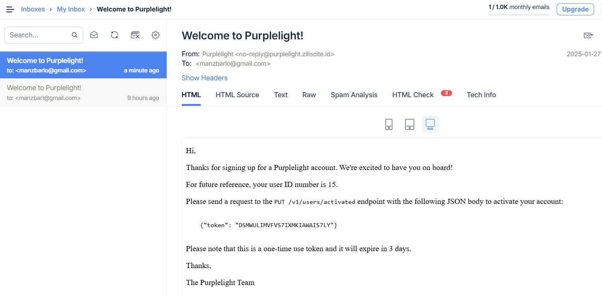

# Chapter 14. User Activation
At the moment a user can register for an account with our Greenlight -- Purplelight for me -- API, but we don’t know for sure that the email address they provided during registration actually belongs to them.

So, in this section of the book, we’re going to build up the functionality to confirm that a user used their own real email address by including ‘account activation’ instructions in their welcome email.

The account activation process will work like this:

1. As part of the registration process for a new user we will create a cryptographically-secure random activation token that is impossible to guess.
2. We will then store a hash of this activation token in a new tokens table, alongside the new user’s ID and an expiry time for the token.
3. We will send the original (unhashed) activation token to the user in their welcome email.
4. The user subsequently submits their token to a new PUT /v1/users/activated endpoint.
5. If the hash of the token exists in the tokens table and hasn’t expired, then we’ll update the activated status for the relevant user to true.
6. Lastly, we’ll delete the activation token from our tokens table so that it can’t be used again.

In this section of the book, you’ll learn how to:

- Implement a secure ‘account activation’ workflow which verifies a new user’s email address.
- Generate cryptographically-secure random tokens using Go’s crypto/rand and encoding/base32 packages.
- Generate fast hashes of data using the crypto/sha256 package.
- Implement patterns for working with cross-table relationships in your database, including setting up foreign keys and retrieving related data via SQL JOIN queries.

## Setting up the Tokens Database Table
Let’s begin by creating a new tokens table in our database to store the activation tokens for our users.

```shell
migrate create -seq -ext .sql -dir ./migrations create_tokens_table
```

up.sql
```sql
CREATE TABLE IF NOT EXISTS tokens (
    hash bytea PRIMARY KEY,
    user_id bigint NOT NULL REFERENCES users ON DELETE CASCADE,
    expiry timestamp(0) with time zone NOT NULL,
    scope text NOT NULL
);
```

down.sql
```shell
DROP TABLE IF EXISTS tokens;
```

- The hash column will contain a SHA-256 hash of the activation token. It’s important to emphasize that we will only store a hash of the activation token in our database — not the activation token itself.
- We want to hash the token before storing it for the same reason that we bcrypt a user’s password — it provides an extra layer of protection if the database is ever compromised or leaked. Because our activation token is going to be a high-entropy random string (128 bits) — rather than something low entropy like a typical user password — it is sufficient to use a fast algorithm like SHA-256 to create the hash, instead of a slow algorithm like bcrypt.
- The user_id column will contain the ID of the user associated with the token. We use the REFERENCES user syntax to create a foreign key constraint against the primary key of our users table, which ensures that any value in the user_id column has a corresponding id entry in our users table.
- We also use the ON DELETE CASCADE syntax to instruct PostgreSQL to automatically delete all records for a user in our tokens table when the parent record in the users table is deleted.

> Note: A common alternative to ON DELETE CASCADE is ON DELETE RESTRICT, which in our case would prevent a parent record in the users table from being deleted if the user has any tokens in our tokens table. If you use ON DELETE RESTRICT, you would need to manually delete any tokens for the user before you delete the user record itself.

- The expiry column will contain the time that we consider a token to be ‘expired’ and no longer valid. Setting a short expiry time is good from a security point-of-view because it helps reduce the window of possibility for a successful brute-force attack against the token. And it also helps in the scenario where the user is sent a token but doesn’t use it, and their email account is compromised at a later time. By setting a short time limit, it reduces the time window that the compromised token could be used.
- Of course, the security risks here need to be weighed up against usability, and we want the expiry time to be long enough for a user to be able to activate the account at their leisure. In our case, we’ll set the expiry time for our activation tokens to 3 days from the moment the token was created.
- Lastly, the scope column will denote what purpose the token can be used for. Later in the book we’ll also need to create and store authentication tokens, and most of the code and storage requirements for these is exactly the same as for our activation tokens. So instead of creating separate tables (and the code to interact with them), we’ll store them in one table with a value in the scope column to restrict the purpose that the token can be used for.

Run the migrations
```shell
migrate -path ./migrations -database $PURPLELIGHT_DB_DSN up
```

## Creating Secure Activation Tokens
The integrity of our activation process hinges on one key thing: the ‘unguessability’ of the token that we send to the user’s email address.

Because of this, we want the token to be generated by a cryptographically secure random number generator (CSPRNG) and have enough entropy (or randomness) that it is impossible to guess.

In our case, we’ll create our activation tokens using Go’s crypto/rand package and 128-bits (16 bytes) of entropy.

```go
// Define constants for the token scope. For now we just define the scope "activation"
// but we'll add additional scopes later in the book.
const (
    ScopeActivation = "activation"
)

// Define a Token struct to hold the data for an individual token. This includes the 
// plaintext and hashed versions of the token, associated user ID, expiry time and 
// scope.
type Token struct {
    Plaintext string
    Hash      []byte
    UserID    int64
    Expiry    time.Time
    Scope     string
}

func generateToken(userID int64, ttl time.Duration, scope string) (*Token, error) {
    // Create a Token instance containing the user ID, expiry, and scope information.  
    // Notice that we add the provided ttl (time-to-live) duration parameter to the 
    // current time to get the expiry time?
    token := &Token{
        UserID: userID,
        Expiry: time.Now().Add(ttl),
        Scope:  scope,
    }

    // Initialize a zero-valued byte slice with a length of 16 bytes.
    randomBytes := make([]byte, 16)

    // Use the Read() function from the crypto/rand package to fill the byte slice with 
    // random bytes from your operating system's CSPRNG. This will return an error if 
    // the CSPRNG fails to function correctly.
    _, err := rand.Read(randomBytes)
    if err != nil {
        return nil, err
    }

    // Encode the byte slice to a base-32-encoded string and assign it to the token 
    // Plaintext field. This will be the token string that we send to the user in their
    // welcome email. They will look similar to this:
    //
    // Y3QMGX3PJ3WLRL2YRTQGQ6KRHU
    // 
    // Note that by default base-32 strings may be padded at the end with the = 
    // character. We don't need this padding character for the purpose of our tokens, so 
    // we use the WithPadding(base32.NoPadding) method in the line below to omit them.
    token.Plaintext = base32.StdEncoding.WithPadding(base32.NoPadding).EncodeToString(randomBytes)

    // Generate a SHA-256 hash of the plaintext token string. This will be the value 
    // that we store in the `hash` field of our database table. Note that the 
    // sha256.Sum256() function returns an *array* of length 32, so to make it easier to  
    // work with we convert it to a slice using the [:] operator before storing it.
    hash := sha256.Sum256([]byte(token.Plaintext))
    token.Hash = hash[:]

    return token, nil
}
```

It’s important to point out that the plaintext token strings we’re creating here like Y3QMGX3PJ3WLRL2YRTQGQ6KRHU are not 16 characters long — but rather they have an underlying entropy of 16 bytes of randomness.

### Creating the TokenModel and Validation Checks
- Insert() to insert a new token record in the database.
- New() will be a shortcut method which creates a new token using the generateToken() function and then calls Insert() to store the data.
- DeleteAllForUser() to delete all tokens with a specific scope for a specific user.
- We’ll also create a new ValidateTokenPlaintext() function, which will check that a plaintext token provided by a client in the future is exactly 26 bytes long.

```go
// Check that the plaintext token has been provided and is exactly 26 bytes long.
func ValidateTokenPlaintext(v *validator.Validator, tokenPlaintext string) {
    v.Check(tokenPlaintext != "", "token", "must be provided")
    v.Check(len(tokenPlaintext) == 26, "token", "must be 26 bytes long")
}

// Define the TokenModel type.
type TokenModel struct {
    DB *sql.DB
}

// The New() method is a shortcut which creates a new Token struct and then inserts the
// data in the tokens table.
func (m TokenModel) New(userID int64, ttl time.Duration, scope string) (*Token, error) {
    token, err := generateToken(userID, ttl, scope)
    if err != nil {
        return nil, err
    }

    err = m.Insert(token)
    return token, err
}

// Insert() adds the data for a specific token to the tokens table.
func (m TokenModel) Insert(token *Token) error {
    query := `
        INSERT INTO tokens (hash, user_id, expiry, scope) 
        VALUES ($1, $2, $3, $4)`

    args := []any{token.Hash, token.UserID, token.Expiry, token.Scope}

    ctx, cancel := context.WithTimeout(context.Background(), 3*time.Second)
    defer cancel()

    _, err := m.DB.ExecContext(ctx, query, args...)
    return err
}

// DeleteAllForUser() deletes all tokens for a specific user and scope.
func (m TokenModel) DeleteAllForUser(scope string, userID int64) error {
    query := `
        DELETE FROM tokens 
        WHERE scope = $1 AND user_id = $2`

    ctx, cancel := context.WithTimeout(context.Background(), 3*time.Second)
    defer cancel()

    _, err := m.DB.ExecContext(ctx, query, scope, userID)
    return err
}
```

Also the model
```go
type Models struct {
    Movies MovieModel
    Tokens TokenModel // Add a new Tokens field.
    Users  UserModel
}

func NewModels(db *sql.DB) Models {
    return Models{
        Movies: MovieModel{DB: db},
        Tokens: TokenModel{DB: db}, // Initialize a new TokenModel instance.
        Users:  UserModel{DB: db},
    }
}
```

## Sending Activation Tokens
The next step is to hook this up to our registerUserHandler, so that we generate an activation token when a user signs up and include it in their welcome email — similar to this:
```templ
Hi,

Thanks for signing up for a Greenlight account. We're excited to have you on board!

For future reference, your user ID number is 123.

Please send a request to the `PUT /v1/users/activated` endpoint with the following JSON
body to activate your account:

{"token": "Y3QMGX3PJ3WLRL2YRTQGQ6KRHU"}

Please note that this is a one-time use token and it will expire in 3 days.

Thanks,

The Greenlight Team
```

// Why not just send the user an endpoint containing the token on the header?

The most important thing about this email is that we’re instructing the user to activate by issuing a PUT request to our API — not by clicking a link which contains the token as part of the URL path or query string.

Having a user click a link to activate via a GET request (which is used by default when clicking a link) would certainly be more convenient, but in the case of our API it has some big drawbacks. In particular:

> That could result in a scenario where a malicious actor (Eve) wants to make an account using someone else’s email (Alice). Eve signs up, and Alice received an email. Alice opens the email because she is curious about an account she didn’t request. Her browser (or antivirus) requests the URL in the background, inadvertently activating the account.

All-in-all, you should make sure that any actions which change the state of your application (including activating a user) are only ever executed via POST, PUT, PATCH or DELETE requests — not by GET requests.

> If your API is the back-end for a website, then you could adapt this email so that it asks the user to click a link which takes them to a page on your website. They can then click a button on the page to ‘confirm their activation’, which performs the PUT request to your API that actually activates the user.

// Yep, the header thing is a bad idea. But there is a way, it seems

internal/mailer/templates/user_welcome.tmpl
```templ
{{define "subject"}}Welcome to Greenlight!{{end}}

{{define "plainBody"}}
Hi,

Thanks for signing up for a Greenlight account. We're excited to have you on board!

For future reference, your user ID number is {{.userID}}.

Please send a request to the `PUT /v1/users/activated` endpoint with the following JSON
body to activate your account:

{"token": "{{.activationToken}}"}

Please note that this is a one-time use token and it will expire in 3 days.

Thanks,

The Greenlight Team
{{end}}

{{define "htmlBody"}}
<!doctype html>
<html>

<head>
    <meta name="viewport" content="width=device-width" />
    <meta http-equiv="Content-Type" content="text/html; charset=UTF-8" />
</head>

<body>
    <p>Hi,</p>
    <p>Thanks for signing up for a Greenlight account. We're excited to have you on board!</p>
    <p>For future reference, your user ID number is {{.userID}}.</p>
     <p>Please send a request to the <code>PUT /v1/users/activated</code> endpoint with the 
    following JSON body to activate your account:</p>
    <pre><code>
    {"token": "{{.activationToken}}"}
    </code></pre>
    <p>Please note that this is a one-time use token and it will expire in 3 days.</p>
    <p>Thanks,</p>
    <p>The Greenlight Team</p>
</body>

</html>
{{end}}
```

File: cmd/api/users.go
```go
func (app *application) registerUserHandler(w http.ResponseWriter, r *http.Request) {

    ...

    err = app.models.Users.Insert(user)
    if err != nil {
        switch {
        case errors.Is(err, data.ErrDuplicateEmail):
            v.AddError("email", "a user with this email address already exists")
            app.failedValidationResponse(w, r, v.Errors)
        default:
            app.serverErrorResponse(w, r, err)
        }
        return
    }

    // After the user record has been created in the database, generate a new activation
    // token for the user.
    token, err := app.models.Tokens.New(user.ID, 3*24*time.Hour, data.ScopeActivation)
    if err != nil {
        app.serverErrorResponse(w, r, err)
        return
    }

    app.background(func() {
        // As there are now multiple pieces of data that we want to pass to our email
        // templates, we create a map to act as a 'holding structure' for the data. This
        // contains the plaintext version of the activation token for the user, along 
        // with their ID.
        data := map[string]any{
            "activationToken": token.Plaintext,
            "userID":          user.ID,
        }

        // Send the welcome email, passing in the map above as dynamic data.
        err = app.mailer.Send(user.Email, "user_welcome.tmpl", data)
        if err != nil {
            app.logger.Error(err.Error())
        }
    })

    err = app.writeJSON(w, http.StatusAccepted, envelope{"user": user}, nil)
    if err != nil {
        app.serverErrorResponse(w, r, err)
    }
}
```

Restart the application, and then register a new user account


### Creating Additional Activation Tokens
This can be useful in scenarios where a user doesn’t activate their account in time, or they never receive their welcome email.

File: cmd/api/tokens.go
```go
func (app *application) createActivationTokenHandler(w http.ResponseWriter, r *http.Request) {
    // Parse and validate the user's email address.
    var input struct {
        Email string `json:"email"`
    }

    err := app.readJSON(w, r, &input)
    if err != nil {
        app.badRequestResponse(w, r, err)
        return
    }

    v := validator.New()

    if data.ValidateEmail(v, input.Email); !v.Valid() {
        app.failedValidationResponse(w, r, v.Errors)
        return
    }

    // Try to retrieve the corresponding user record for the email address. If it can't
    // be found, return an error message to the client.
    user, err := app.models.Users.GetByEmail(input.Email)
    if err != nil {
        switch {
        case errors.Is(err, data.ErrRecordNotFound):
            v.AddError("email", "no matching email address found")
            app.failedValidationResponse(w, r, v.Errors)
        default:
            app.serverErrorResponse(w, r, err)
        }
        return
    }

    // Return an error if the user has already been activated.
    if user.Activated {
        v.AddError("email", "user has already been activated")
        app.failedValidationResponse(w, r, v.Errors)
        return
    }

    // Otherwise, create a new activation token.
    token, err := app.models.Tokens.New(user.ID, 3*24*time.Hour, data.ScopeActivation)
    if err != nil {
        app.serverErrorResponse(w, r, err)
        return
    }

    // Email the user with their additional activation token.
    app.background(func() {
        data := map[string]any{
            "activationToken": token.Plaintext,
        }

        // Since email addresses MAY be case sensitive, notice that we are sending this 
        // email using the address stored in our database for the user --- not to the 
        // input.Email address provided by the client in this request.
        err = app.mailer.Send(user.Email, "token_activation.tmpl", data)
        if err != nil {
            app.logger.Error(err.Error())
        }
    })

    // Send a 202 Accepted response and confirmation message to the client.
    env := envelope{"message": "an email will be sent to you containing activation instructions"}

    err = app.writeJSON(w, http.StatusAccepted, env, nil)
    if err != nil {
        app.serverErrorResponse(w, r, err)
    }
}
```

File: internal/mailer/templates/token_activation.tmpl
```templ
{{define "subject"}}Activate your Greenlight account{{end}}

{{define "plainBody"}}
Hi,

Please send a `PUT /v1/users/activated` request with the following JSON body to activate your account:

{"token": "{{.activationToken}}"}

Please note that this is a one-time use token and it will expire in 3 days.

Thanks,

The Greenlight Team
{{end}}

{{define "htmlBody"}}
<!doctype html>
<html>
  <head>
    <meta name="viewport" content="width=device-width" />
    <meta http-equiv="Content-Type" content="text/html; charset=UTF-8" />
  </head>
  <body>
    <p>Hi,</p>
    <p>Please send a <code>PUT /v1/users/activated</code> request with the following JSON body to activate your account:</p>
    <pre><code>
    {"token": "{{.activationToken}}"}
    </code></pre> 
    <p>Please note that this is a one-time use token and it will expire in 3 days.</p>
    <p>Thanks,</p>
    <p>The Greenlight Team</p>
  </body>
</html>
{{end}}
```

A user can request a new activation token by submitting their email address like this:
```shell
$ curl -X POST -d '{"email": "bob@example.com"}' localhost:4000/v1/tokens/activation
{
    "message": "an email will be sent to you containing activation instructions"
}
```

The token will be sent to them in an email, and they can then submit the token to the PUT /v1/users/activated endpoint to activate, in exactly the same way as if they received the token in their welcome email.

## Activating a User
`PUT	/v1/users/activated 	activateUserHandler	    Activate a specific user`

Workflow will look like this:
- The user submits the plaintext activation token (which they just received in their email) to the PUT /v1/users/activated endpoint.
- We validate the plaintext token to check that it matches the expected format, sending the client an error message if necessary.
- We then call the UserModel.GetForToken() method to retrieve the details of the user associated with the provided token. If there is no matching token found, or it has expired, we send the client an error message.
- We activate the associated user by setting activated = true on the user record and update it in our database.
- We delete all activation tokens for the user from the tokens table. We can do this using the TokenModel.DeleteAllForUser() method that we made earlier.
- We send the updated user details in a JSON response.

cmd/api/users.go
```go
func (app *application) activateUserHandler(w http.ResponseWriter, r *http.Request) {
    // Parse the plaintext activation token from the request body.
    var input struct {
        TokenPlaintext string `json:"token"`
    }

    err := app.readJSON(w, r, &input)
    if err != nil {
        app.badRequestResponse(w, r, err)
        return
    }

    // Validate the plaintext token provided by the client.
    v := validator.New()

    if data.ValidateTokenPlaintext(v, input.TokenPlaintext); !v.Valid() {
        app.failedValidationResponse(w, r, v.Errors)
        return
    }

    // Retrieve the details of the user associated with the token using the 
    // GetForToken() method (which we will create in a minute). If no matching record
    // is found, then we let the client know that the token they provided is not valid.
    user, err := app.models.Users.GetForToken(data.ScopeActivation, input.TokenPlaintext)
    if err != nil {
        switch {
        case errors.Is(err, data.ErrRecordNotFound):
            v.AddError("token", "invalid or expired activation token")
            app.failedValidationResponse(w, r, v.Errors)
        default:
            app.serverErrorResponse(w, r, err)
        }
        return
    }

    // Update the user's activation status.
    user.Activated = true

    // Save the updated user record in our database, checking for any edit conflicts in
    // the same way that we did for our movie records.
    err = app.models.Users.Update(user)
    if err != nil {
        switch {
        case errors.Is(err, data.ErrEditConflict):
            app.editConflictResponse(w, r)
        default:
            app.serverErrorResponse(w, r, err)
        }
        return
    }

    // If everything went successfully, then we delete all activation tokens for the
    // user.
    err = app.models.Tokens.DeleteAllForUser(data.ScopeActivation, user.ID)
    if err != nil {
        app.serverErrorResponse(w, r, err)
        return
    }

    // Send the updated user details to the client in a JSON response.
    err = app.writeJSON(w, http.StatusOK, envelope{"user": user}, nil)
    if err != nil {
        app.serverErrorResponse(w, r, err)
    }
}
```

### The UserModel.GetForToken method
We want the UserModel.GetForToken() method to retrieve the details of the user associated with a particular activation token.

```sql
SELECT users.id, users.created_at, users.name, users.email, users.password_hash, users.activated, users.version
FROM users
INNER JOIN tokens
ON users.id = tokens.user_id
WHERE tokens.hash = $1
AND tokens.scope = $2 
AND tokens.expiry > $3
```

In this query we are using INNER JOIN to join together information from the users and tokens tables. Specifically, we’re using the ON users.id = tokens.user_id clause to indicate that we want to join records where the user id value equals the token user_id.

Behind the scenes, you can think of INNER JOIN as creating an ‘interim’ table containing the joined data from both tables. Then, in our SQL query, we use the WHERE clause to filter this interim table to leave only rows where the token hash and token scope match specific placeholder parameter values, and the token expiry is after a specific time. Because the token hash is also a primary key, we will always be left with exactly one record which contains the details of the user associated with the token hash (or no records at all, if there wasn’t a matching token).

Article regarding joins: https://www.dataquest.io/blog/sql-joins/

```go
func (m UserModel) GetForToken(tokenScope, tokenPlaintext string) (*User, error) {
    // Calculate the SHA-256 hash of the plaintext token provided by the client.
    // Remember that this returns a byte *array* with length 32, not a slice.
    tokenHash := sha256.Sum256([]byte(tokenPlaintext))

    // Set up the SQL query.
    query := `
        SELECT users.id, users.created_at, users.name, users.email, users.password_hash, users.activated, users.version
        FROM users
        INNER JOIN tokens
        ON users.id = tokens.user_id
        WHERE tokens.hash = $1
        AND tokens.scope = $2 
        AND tokens.expiry > $3`

    // Create a slice containing the query arguments. Notice how we use the [:] operator
    // to get a slice containing the token hash, rather than passing in the array (which
    // is not supported by the pq driver), and that we pass the current time as the
    // value to check against the token expiry.
    args := []any{tokenHash[:], tokenScope, time.Now()}

    var user User

    ctx, cancel := context.WithTimeout(context.Background(), 3*time.Second)
    defer cancel()

    // Execute the query, scanning the return values into a User struct. If no matching
    // record is found we return an ErrRecordNotFound error.
    err := m.DB.QueryRowContext(ctx, query, args...).Scan(
        &user.ID,
        &user.CreatedAt,
        &user.Name,
        &user.Email,
        &user.Password.hash,
        &user.Activated,
        &user.Version,
    )
    if err != nil {
        switch {
        case errors.Is(err, sql.ErrNoRows):
            return nil, ErrRecordNotFound
        default:
            return nil, err
        }
    }

    // Return the matching user.
    return &user, nil
}
```

File: cmd/api/routes.go
```go
func (app *application) routes() http.Handler {
    router := httprouter.New()

    router.NotFound = http.HandlerFunc(app.notFoundResponse)
    router.MethodNotAllowed = http.HandlerFunc(app.methodNotAllowedResponse)

    router.HandlerFunc(http.MethodGet, "/v1/healthcheck", app.healthcheckHandler)

    router.HandlerFunc(http.MethodGet, "/v1/movies", app.listMoviesHandler)
    router.HandlerFunc(http.MethodPost, "/v1/movies", app.createMovieHandler)
    router.HandlerFunc(http.MethodGet, "/v1/movies/:id", app.showMovieHandler)
    router.HandlerFunc(http.MethodPatch, "/v1/movies/:id", app.updateMovieHandler)
    router.HandlerFunc(http.MethodDelete, "/v1/movies/:id", app.deleteMovieHandler)

    router.HandlerFunc(http.MethodPost, "/v1/users", app.registerUserHandler)
    // Add the route for the PUT /v1/users/activated endpoint.
    router.HandlerFunc(http.MethodPut, "/v1/users/activated", app.activateUserHandler)

    return app.recoverPanic(app.rateLimit(router))
}
```

Why are using PUT rather than POST for this endpoint is because it’s idempotent.

If a client sends the same PUT /v1/users/activated request multiple times, the first will succeed (assuming the token is valid) and then any subsequent requests will result in an error being sent to the client (because the token has been used and deleted from the database).

But the important thing is that nothing in our application state (i.e. database) changes after that first request.

Basically, there are no application state side-effects from the client sending the same request multiple times, which means that the endpoint is idempotent and using PUT is more appropriate than POST.

Try making some requests
```shell
$ curl -X PUT -d '{"token": "invalid"}' localhost:4000/v1/users/activated
{
    "error": {
        "token": "must be 26 bytes long"
    }
}

$ curl -X PUT -d '{"token": "ABCDEFGHIJKLMNOPQRSTUVWXYZ"}' localhost:4000/v1/users/activated
{
    "error": {
        "token": "invalid or expired activation token"
    }
}
```

If you try repeating the request again with the same valid token, you should now get an "invalid or expired activation token" error due to the fact we have deleted all activation tokens.
```shell
$ curl -X PUT -d '{"token": "P4B3URJZJ2NW5UPZC2OHN4H2NM"}' localhost:4000/v1/users/activated
{
    "error": {
        "token": "invalid or expired activation token"
    }
}
```

> In production, with activation tokens for real accounts, you must make sure that the tokens are only ever accepted over an encrypted HTTPS connection — not via regular HTTP like we are using here.

### Web application workflow
If your API is the backend to a website, rather than a completely standalone service, you can tweak the activation workflow to make it simpler and more intuitive for users while still being secure.

There are two main options here. The first, and most robust, option is to ask the user to copy-and-paste the token into a form on your website which then performs the PUT /v1/users/activate request for them using some JavaScript.
```templ
Hi,

Thanks for signing up for a Greenlight account. We're excited to have you on board!

For future reference, your user ID number is 123.

To activate your Greenlight account please visit https://example.com/users/activate and 
enter the following code:

--------------------------
Y3QMGX3PJ3WLRL2YRTQGQ6KRHU
--------------------------

Please note that this code will expire in 3 days and can only be used once.

Thanks,

The Greenlight Team
```

> When creating the link in this email, don’t rely on the Host header from r.Host to construct the URL, as that would be vulnerable to a host header injection attack. The URL domain should be either be hard-coded or passed in as a command-line flag when starting the application.

Alternatively, if you don’t want the user to copy-and-paste a token, you could ask them to click a link containing the token which takes them to a page on your website.
```templ
Hi,

Thanks for signing up for a Greenlight account. We're excited to have you on board!

For future reference, your user ID number is 123.

To activate your Greenlight account please click the following link:

https://example.com/users/activate?token=Y3QMGX3PJ3WLRL2YRTQGQ6KRHU

Please note that this link will expire in 3 days and can only be used once.

Thanks,

The Greenlight Team
```

This page should then display a button that says something like ‘Confirm your account activation’, and some JavaScript on the webpage can extract the token from the URL and submit it to your PUT /v1/users/activate


