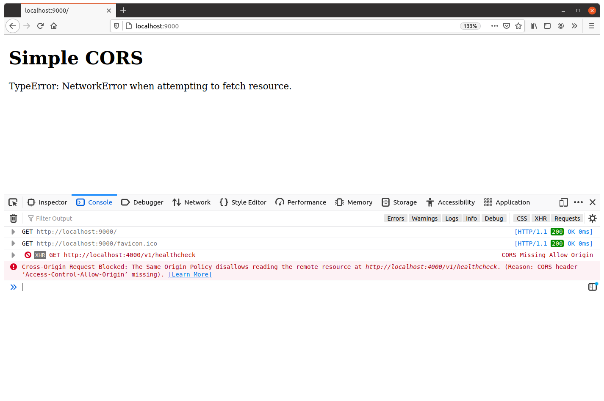
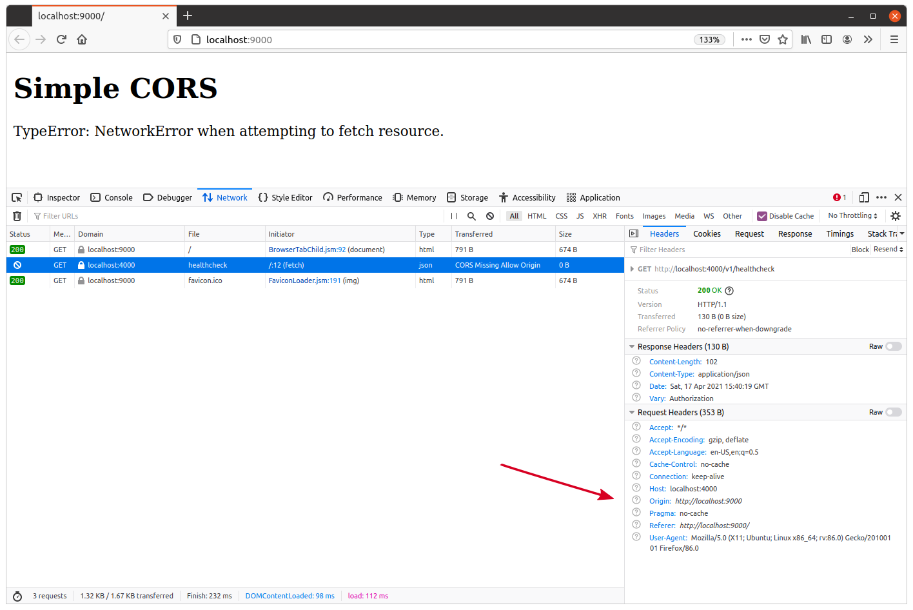
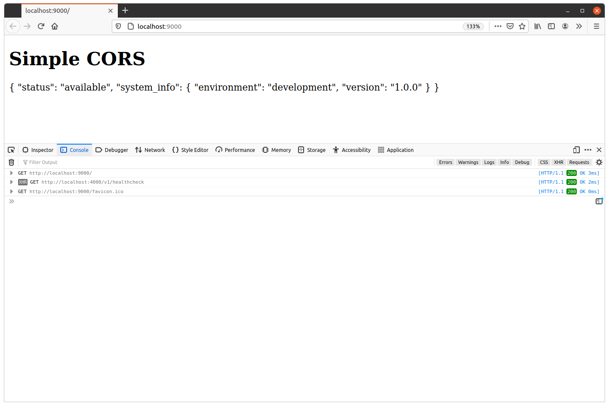
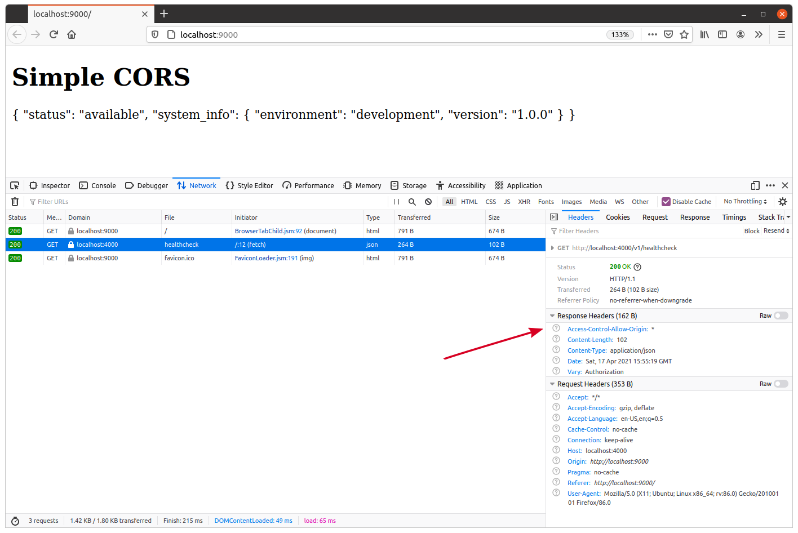
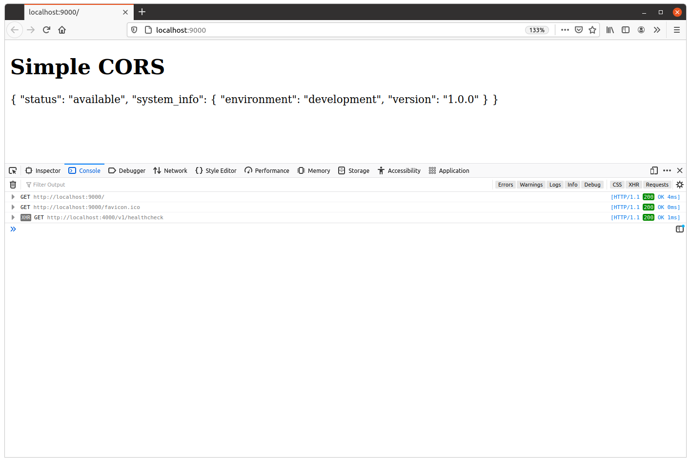
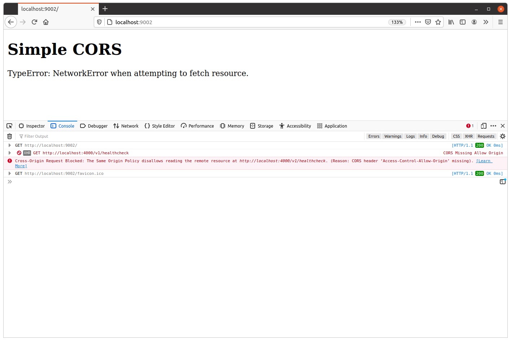
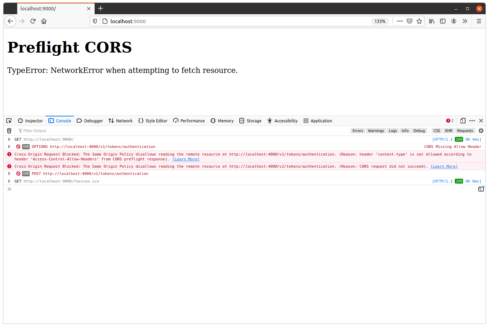
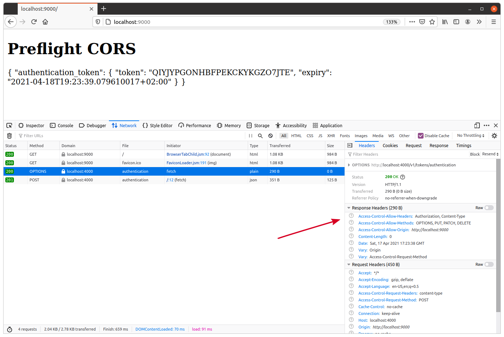

# Chapter 17. Cross Origin Requests
We’re going to switch to a completely new topic and update our application so that it supports cross-origin requests (CORS) from JavaScript.

- What cross-origin requests are, and why web browsers prevent them by default.
- The difference between simple and preflight cross-origin requests.
- How to use Access-Control headers to allow or disallow specific cross-origin requests.
- About the security considerations you need to be aware of when CORS configuring settings in your application.

## An Overview of CORS
Basically, if two URLs have the same scheme, host and port (if specified) they are said to share the same origin.

| URL A | URL B | Same origin? | Reason |
| --- | --- | --- | --- |
| https://foo.com/a | http://foo.com/a | No | Different scheme (http vs https) |
| http://foo.com/a | http://www.foo.com/a | No | Different host (foo.com vs www.foo.com) |
| http://foo.com/a | http://foo.com:443/a | No | Different port (no port vs 443) |
| http://foo.com/a | http://foo.com/b | Yes | Only the path is different |
| http://foo.com/a | http://foo.com/a?b=c | Yes | Only the query string is different |
| http://foo.com/a#b | http://foo.com/a#c | Yes | Only the fragment is different |

Understanding what origins are is important because all web browsers implement a security mechanism known as the same-origin policy.

- A webpage on one origin can embed certain types of resources from another origin in their HTML — including images, CSS, and JavaScript files. For example, doing this is in your webpage is OK:
`

`

- A webpage on one origin can send data to a different origin. For example, it’s OK for an HTML form in a webpage to submit data to a different origin.

- But a webpage on one origin is not allowed to receive data from a different origin.

> the same-origin policy prevents a (potentially malicious) website on another origin from reading (possibly confidential) information from your website.

Sending of data is not prevented by the same-origin policy, despite also being dangerous. In fact, this is why CSRF attacks are possible and why we need to take additional steps to prevent them — like using SameSite cookies and CSRF tokens.

Let’s say that you have a webpage at https://foo.com containing some front-end.  
If this front-end tries to make an HTTP request to https://bar.com/data.json (a different origin), 
then the request will be sent and processed by the bar.com server, but the user’s web browser will block the response so that the JavaScript code from https://foo.com cannot see it.

## Demonstrating the Same-Origin Policy
To demonstrate how the same-origin policy works and how to relax it for requests to our API, we need to simulate a request to our API from a different origin.

As we’re already using Go in this book, let’s quickly make a second, very simple, Go application to make this cross-origin request.

File: cmd/examples/cors/simple/main.go
```go
package main

import (
    "flag"
    "log"
    "net/http"
)

// HTML a string constant containing the HTML for the webpage. This consists of a <h1>
// header tag, and some JavaScript which fetches the JSON from our GET /v1/healthcheck
// endpoint and writes it to inside the <div id="output"></div> element.
const HTML = `
<!DOCTYPE html>
<html lang="en">
<head>
    <meta charset="UTF-8">
</head>
<body>
    <h1>Simple CORS</h1>
    <div id="output"></div>
    <script>
        document.addEventListener('DOMContentLoaded', function() {
            fetch("http://localhost:4000/v1/healthcheck").then(
                function (response) {
                    response.text().then(function (text) {
                        document.getElementById("output").innerHTML = text;
                    });
                }, 
                function(err) {
                    document.getElementById("output").innerHTML = err;
                }
            );
        });
    </script>
</body>
</html>
`

func main() {
    // Make the server address configurable at runtime via a command-line flag.
    addr := flag.String("addr", ":9000", "Server address")
    flag.Parse()

    log.Printf("starting server on %s", *addr)

    // Start a HTTP server listening on the given address, which responds to all
    // requests with the webpage HTML above.
    err := http.ListenAndServe(*addr, http.HandlerFunc(func(w http.ResponseWriter, r *http.Request) {
        w.Write([]byte(HTML))
    }))
	
    log.Fatal(err)
}
```

In this code:
- We use the fetch() function to make a request to our API healthcheck endpoint. By default this sends a GET request, but it’s also possible to configure this to use different HTTP methods and add custom headers. We’ll explain how to do that later.
- The fetch() method works asynchronously and returns a promise. We use the then() method on the promise to set up two callback functions: the first callback is executed if fetch() is successful, and the second is executed if there is a failure.
- In our ‘successful’ callback we read the response body with response.text(), and use document.getElementById("output").innerHTML to replace the contents of the <div id="output"></div> element with this response body.
- In the ‘failure’ callback we replace the contents of the <div id="output"></div> element with the error message.
- This logic is all wrapped up in document.addEventListener(‘DOMContentLoaded’, function(){…}), which essentially means that fetch() won’t be called until the user’s web browser has completely loaded the HTML document.

### Demonstration
Go ahead and start up the new application:
```shell
$ go run ./cmd/examples/cors/simple
2021/04/17 17:23:14 starting server on :9000
```

Open a second terminal window and start our regular API application at the same time:
```shell
$ go run ./cmd/api
time=2023-09-10T10:59:13.722+02:00 level=INFO msg="database connection pool established"
time=2023-09-10T10:59:13.722+02:00 level=INFO msg="starting server" addr=:4000 env=development
```

At this point, you should now have the API running on the origin http://localhost:4000 and the webpage with the JavaScript running on the origin http://localhost:9000. Because the ports are different, these are two different origins.

So, when you visit http://localhost:9000 in your web browser, the fetch() action to http://localhost:4000/v1/healthcheck should be forbidden by the same-origin policy. Specifically, our API should receive and process the request, but your web browser should block the response from being read by the JavaScript code.


> The error message you see here is defined by your web browser.

You may also want to open the network activity tab in your developer tools and examine the HTTP headers.


> the request itself was not prevented by the same-origin policy — it’s just that the browser won’t let JavaScript see the response.

Web browser automatically set an Origin header on the request to show where the request originates from.
`Origin: http://localhost:9000`

## Simple CORS Requests
Let’s now make some changes to our API which relax the same-origin policy, so that JavaScript can read the responses from our API endpoints.

The simplest way to achieve this is by setting the following header on all our API responses:
```shell
Access-Control-Allow-Origin: *
```

The Access-Control-Allow-Origin response header is used to indicate to a browser that it’s OK to share a response with a different origin.

File: cmd/api/middleware.go
```go
func (app *application) enableCORS(next http.Handler) http.Handler {
    return http.HandlerFunc(func(w http.ResponseWriter, r *http.Request) {
        w.Header().Set("Access-Control-Allow-Origin", "*")

        next.ServeHTTP(w, r)
    })
}
```

File: cmd/api/routes.go
```go
func (app *application) routes() http.Handler {
    router := httprouter.New()

    router.NotFound = http.HandlerFunc(app.notFoundResponse)
    router.MethodNotAllowed = http.HandlerFunc(app.methodNotAllowedResponse)

    router.HandlerFunc(http.MethodGet, "/v1/healthcheck", app.healthcheckHandler)

    router.HandlerFunc(http.MethodGet, "/v1/movies", app.requirePermission("movies:read", app.listMoviesHandler))
    router.HandlerFunc(http.MethodPost, "/v1/movies", app.requirePermission("movies:write", app.createMovieHandler))
    router.HandlerFunc(http.MethodGet, "/v1/movies/:id", app.requirePermission("movies:read", app.showMovieHandler))
    router.HandlerFunc(http.MethodPatch, "/v1/movies/:id", app.requirePermission("movies:write", app.updateMovieHandler))
    router.HandlerFunc(http.MethodDelete, "/v1/movies/:id", app.requirePermission("movies:write", app.deleteMovieHandler))

    router.HandlerFunc(http.MethodPost, "/v1/users", app.registerUserHandler)
    router.HandlerFunc(http.MethodPut, "/v1/users/activated", app.activateUserHandler)

    router.HandlerFunc(http.MethodPost, "/v1/tokens/authentication", app.createAuthenticationTokenHandler)

    // Add the enableCORS() middleware.
    return app.recoverPanic(app.enableCORS(app.rateLimit(app.authenticate(router))))
}
```

It’s important to point out here that the enableCORS() middleware is deliberately positioned early in the middleware chain.

If we positioned it after our rate limiter, for example, any cross-origin requests that exceed the rate limit would not have the Access-Control-Allow-Origin header set. This means that they would be blocked by the client’s web browser due to the same-origin policy, rather than the client receiving a 429 Too Many Requests response like they should.

This time the cross-origin request should complete successfully


You should see that the `Access-Control-Allow-Origin: *` header has been set on the response


### Restricting Origins
Using a wildcard to allow cross-origin requests, like we are in the code above, can be useful in certain circumstances (like when you have a completely public API with no access control checks). But more often you’ll probably want to restrict CORS to a much smaller set of trusted origins.

To do this, you need to explicitly include the trusted origins in the Access-Control-Allow-Origin header instead of using a wildcard.
`Access-Control-Allow-Origin: https://www.example.com`

If you only have one, fixed, origin that you want to allow requests from, then doing this is quite simple — you can just update your enableCORS() middleware to hard-code in the necessary origin value.

But if you need to support multiple trusted origins, or you want the value to be configurable at runtime, then things get a bit more complex.

One of the problems is that — in practice — you can only specify exactly one origin in the Access-Control-Allow-Origin header. You can’t include a list of multiple origin values, separated by spaces or commas like you might expect.

To work around this limitation, you’ll need to update your enableCORS() middleware to check if the value of the Origin header matches one of your trusted origins. If it does, then you can reflect (or echo) that value back in the Access-Control-Allow-Origin response header.

> The web origin specification does permit multiple space-separated values in the Access-Control-Allow-Origin header but, unfortunately, no web browsers actually support this.

### Supporting multiple dynamic origins
Update our API so that cross-origin requests are restricted to a list of trusted origins, configurable at runtime.

Add a new -cors-trusted-origins command-line flag to our API application, which we can use to specify the list of trusted origins at runtime. We’ll set this up so that the origins must be separated by a space character.
```shell
$ go run ./cmd/api -cors-trusted-origins="https://www.example.com https://staging.example.com"
```

```go
type config struct {
    port int
    env  string
    db   struct {
        dsn          string
        maxOpenConns int
        maxIdleConns int
        maxIdleTime  time.Duration
    }
    limiter struct {
        enabled bool
        rps     float64
        burst   int
    }
    smtp struct {
        host     string
        port     int
        username string
        password string
        sender   string
    }
    // Add a cors struct and trustedOrigins field with the type []string.
    cors struct {
        trustedOrigins []string
    }
}
```

```go
func main() {
    var cfg config

    flag.IntVar(&cfg.port, "port", 4000, "API server port")
    flag.StringVar(&cfg.env, "env", "development", "Environment (development|staging|production)")

    flag.StringVar(&cfg.db.dsn, "db-dsn", os.Getenv("GREENLIGHT_DB_DSN"), "PostgreSQL DSN")

    flag.IntVar(&cfg.db.maxOpenConns, "db-max-open-conns", 25, "PostgreSQL max open connections")
    flag.IntVar(&cfg.db.maxIdleConns, "db-max-idle-conns", 25, "PostgreSQL max idle connections")
    flag.DurationVar(&cfg.db.maxIdleTime, "db-max-idle-time", 15*time.Minute, "PostgreSQL max connection idle time")

    flag.BoolVar(&cfg.limiter.enabled, "limiter-enabled", true, "Enable rate limiter")
    flag.Float64Var(&cfg.limiter.rps, "limiter-rps", 2, "Rate limiter maximum requests per second")
    flag.IntVar(&cfg.limiter.burst, "limiter-burst", 4, "Rate limiter maximum burst")

    flag.StringVar(&cfg.smtp.host, "smtp-host", "sandbox.smtp.mailtrap.io", "SMTP host")
    flag.IntVar(&cfg.smtp.port, "smtp-port", 25, "SMTP port")
    flag.StringVar(&cfg.smtp.username, "smtp-username", "a7420fc0883489", "SMTP username")
    flag.StringVar(&cfg.smtp.password, "smtp-password", "e75ffd0a3aa5ec", "SMTP password")
    flag.StringVar(&cfg.smtp.sender, "smtp-sender", "Greenlight <no-reply@greenlight.alexedwards.net>", "SMTP sender")

    // Use the flag.Func() function to process the -cors-trusted-origins command line
    // flag. In this we use the strings.Fields() function to split the flag value into a
    // slice based on whitespace characters and assign it to our config struct.
    // Importantly, if the -cors-trusted-origins flag is not present, contains the empty
    // string, or contains only whitespace, then strings.Fields() will return an empty
    // []string slice.
    flag.Func("cors-trusted-origins", "Trusted CORS origins (space separated)", func(val string) error {
        cfg.cors.trustedOrigins = strings.Fields(val)
        return nil
    })

    flag.Parse()

    ...
}
```

The next step is to update our enableCORS() middleware. Specifically, we want the middleware to check if the value of the request Origin header is an exact, case-sensitive, match for one of our trusted origins. If there is a match, then we should set an Access-Control-Allow-Origin response header which reflects (or echoes) back the value of the request’s Origin header.

Otherwise, we should allow the request to proceed as normal without setting an Access-Control-Allow-Origin response header. In turn, that means that any cross-origin responses will be blocked by a web browser, just like they were originally.

A side effect of this is that the response will be different depending on the origin that the request is coming from. Specifically, the value of the Access-Control-Allow-Origin header may be different in the response, or it may not even be included at all.

So because of this we should make sure to always set a `Vary: Origin` response header to warn any caches that the response may be different. This is actually really important, and it can be the cause of subtle bugs like this one if you forget to do it.

> If your code makes a decision about what to return based on the content of a request header, you should include that header name in your Vary response header — even if the request didn’t include that header.

```go
func (app *application) enableCORS(next http.Handler) http.Handler {
    return http.HandlerFunc(func(w http.ResponseWriter, r *http.Request) {
        // Add the "Vary: Origin" header.
        w.Header().Add("Vary", "Origin")

        // Get the value of the request's Origin header.
        origin := r.Header.Get("Origin")

        // Only run this if there's an Origin request header present.
        if origin != "" {
            // Loop through the list of trusted origins, checking to see if the request
            // origin exactly matches one of them. If there are no trusted origins, then 
            // the loop won't be iterated.
            for i := range app.config.cors.trustedOrigins {
                if origin == app.config.cors.trustedOrigins[i] {
                    // If there is a match, then set a "Access-Control-Allow-Origin"
                    // response header with the request origin as the value and break 
                    // out of the loop.
                    w.Header().Set("Access-Control-Allow-Origin", origin)
                    break
                }
            }
        }

        // Call the next handler in the chain.
        next.ServeHTTP(w, r)
    })
}
```

Restart your API, passing in http://localhost:9000 and http://localhost:9001 as trusted origins
```shell
$ go run ./cmd/api -cors-trusted-origins="http://localhost:9000 http://localhost:9001"
time=2023-09-10T10:59:13.722+02:00 level=INFO msg="database connection pool established"
time=2023-09-10T10:59:13.722+02:00 level=INFO msg="starting server" addr=:4000 env=development
```

You should find that the cross-origin request still works successfully.


try running the cmd/examples/cors/simple application with the address :9002.
```shell
$ go run ./cmd/examples/cors/simple --addr=":9002"
2021/04/17 18:24:22 starting server on :9002
```

This will give the webpage an origin of http://localhost:9002 — which isn’t one of our trusted origins — so when you visit http://localhost:9002 in your browser you should find that the cross-origin request is blocked. Like so:


### Partial origin matches
If you have a lot of trusted origins that you want to support, then you might be tempted to check for a partial match on the origin to see if it ‘starts with’ or ‘ends with’ a specific value, or matches a regular expression.

As a simple example, if http://example.com and http://www.example.com are your trusted origins, your first thought might check that the request Origin header ends with example.com.

This would be a bad idea, as an attacker could register the domain name attackerexample.com and any requests from that origin would pass your check.

Generally, it’s best to check the Origin request header against an explicit safelist of full-length trusted origins.

### The null origin
It’s important to never include the value "null" as a trusted origin in your safelist. This is because the request header Origin: null can be forged by an attacker by sending a request from a sandboxed iframe.

### Authentication and CORS
If your API endpoint requires credentials (cookies or HTTP basic authentication) you should also set an Access-Control-Allow-Credentials: true header in your responses.

If you don’t set this header, then the web browser will prevent any cross-origin responses with credentials from being read by JavaScript.

Importantly, you must never use the wildcard Access-Control-Allow-Origin: * header in conjunction with Access-Control-Allow-Credentials: true, as this would allow any website to make a credentialed cross-origin request to your API.

Also, importantly, if you want credentials to be sent with a cross-origin request then you’ll need to explicitly specify this in your JavaScript. For example, with fetch() you should set the credentials value of the request to 'include'. Like so:
```js
fetch("https://api.example.com", {credentials: 'include'}).then( ... );
```

## Preflight CORS Requests
The cross-origin request that we made from JavaScript in the previous chapter is known as a simple cross-origin request. Broadly speaking, cross-origin requests are classified as ‘simple’ when all the following conditions are met:
- The request HTTP method is one of the three CORS-safe methods: HEAD, GET or POST.

- The request headers are all either forbidden headers or one of the four CORS-safe headers:
  - Accept
  - Accept-Language
  - Content-Language
  - Content-Type

- The value for the Content-Type header (if set) is one of:
  - application/x-www-form-urlencoded
  - multipart/form-data
  - text/plain

When a cross-origin request doesn’t meet these conditions, then the web browser will trigger an initial ‘preflight’ request before the real request. The purpose of this preflight request is to determine whether the real cross-origin request will be permitted or not.

### Demonstrating a preflight request
We’ll set up a webpage so it makes a request to our POST /v1/tokens/authentication endpoint. When calling this endpoint we’ll include an email address and password in a JSON request body, along with a Content-Type: application/json header. And because the header Content-Type: application/json isn’t allowed in a ‘simple’ cross-origin request, this should trigger a preflight request to our API.

File: cmd/examples/cors/preflight/main.go
```go
package main

import (
    "flag"
    "log"
    "net/http"
)

// Define a string constant containing the HTML for the webpage. This consists of a <h1>
// header tag, and some JavaScript which calls our POST /v1/tokens/authentication
// endpoint and writes the response body to inside the <div id="output"></div> tag.
const html = `
<!DOCTYPE html>
<html lang="en">
<head>
    <meta charset="UTF-8">
</head>
<body>
    <h1>Preflight CORS</h1>
    <div id="output"></div>
    <script>
        document.addEventListener('DOMContentLoaded', function() {
            fetch("http://localhost:4000/v1/tokens/authentication", {
                method: "POST",
                headers: {
                    'Content-Type': 'application/json'
                },
                body: JSON.stringify({
                    email: 'alice@example.com',
                    password: 'pa55word'
                })
            }).then(
                function (response) {
                    response.text().then(function (text) {
                        document.getElementById("output").innerHTML = text;
                    });
                }, 
                function(err) {
                    document.getElementById("output").innerHTML = err;
                }
            );
        });
    </script>
</body>
</html>`

func main() {
    addr := flag.String("addr", ":9000", "Server address")
    flag.Parse()

    log.Printf("starting server on %s", *addr)

    err := http.ListenAndServe(*addr, http.HandlerFunc(func(w http.ResponseWriter, r *http.Request) {
        w.Write([]byte(html))
    }))
    log.Fatal(err)
}
```

Then open a second terminal window and start our regular API application at the same time with http://localhost:9000 as a trusted origin:
```shell
$ go run ./cmd/api -cors-trusted-origins="http://localhost:9000"
time=2023-09-10T10:59:13.722+02:00 level=INFO msg="database connection pool established"
time=2023-09-10T10:59:13.722+02:00 level=INFO msg="starting server" addr=:4000 env=development
```

Once both are running, open your web browser and navigate to http://localhost:9000. If you look at the console log in your developer tools, you should see a message similar to this:
```
Cross-Origin Request Blocked: The Same Origin Policy disallows reading the remote resource at http://localhost:4000/v1/tokens/authentication. (Reason: header ‘content-type’ is not allowed according to header ‘Access-Control-Allow-Headers’ from CORS preflight response).
```



We can see that there are two requests here marked as ‘blocked’ by the browser:

- An OPTIONS /v1/tokens/authentication request (this is the preflight request).
- A POST /v1/tokens/authentication request (this is the ‘real’ request).


```
Accept: */* 
Accept-Encoding: gzip, deflate
Accept-Language: en-US,en;q=0.5
Access-Control-Request-Headers: content-type
Access-Control-Request-Method: POST
Cache-Control: no-cache
Connection: keep-alive
Host: localhost:4000
Origin: http://localhost:9000
Pragma: no-cache
Referer: http://localhost:9000/
User-Agent: Mozilla/5.0 (X11; Ubuntu; Linux x86_64; rv:86.0) Gecko/20100101 Firefox/86.0
```

There are three headers here which are relevant to CORS:

- Origin — As we saw previously, this lets our API know what origin the preflight request is coming from.
- Access-Control-Request-Method — This lets our API know what HTTP method will be used for the real request (in this case, we can see that the real request will be a POST).
- Access-Control-Request-Headers — This lets our API know what HTTP headers will be sent with the real request (in this case we can see that the real request will include a content-type header).

It’s important to note that `Access-Control-Request-Headers` won’t list all the headers that the real request will use. Only headers that are not CORS-safe or forbidden will be listed.

### Responding to preflight requests
In order to respond to a preflight request, the first thing we need to do is identify that it is a preflight request — rather than just a regular (possibly even cross-origin) OPTIONS request.

To do that, we can leverage the fact that preflight requests always have three components: the HTTP method `OPTIONS`, an `Origin` header, and an `Access-Control-Request-Method` header. If any one of these pieces is missing, we know that it is not a preflight request.

Once we identify that it is a preflight request, we need to send a 200 OK response with some special headers to let the browser know whether or not it’s OK for the real request to proceed.

- An Access-Control-Allow-Origin response header, which reflects the value of the preflight request’s Origin header (just like in the previous chapter).
- An Access-Control-Allow-Methods header listing the HTTP methods that can be used in real cross-origin requests to the URL.
- An Access-Control-Allow-Headers header listing the request headers that can be included in real cross-origin requests to the URL.

In our case, we could set the following response headers to allow cross-origin requests for all our endpoints:
```go
Access-Control-Allow-Origin: <reflected trusted origin>
Access-Control-Allow-Methods: OPTIONS, PUT, PATCH, DELETE 
Access-Control-Allow-Headers: Authorization, Content-Type
```

> When responding to a preflight request it’s not necessary to include the CORS-safe methods HEAD, GET or POST in the Access-Control-Allow-Methods header. Likewise, it’s not necessary to include forbidden or CORS-safe headers in Access-Control-Allow-Headers.

When the web browser receives these headers, it compares the values to the method and (case-insensitive) headers that it wants to use in the real request. If the method or any of the headers are not allowed, then the browser will block the real request.

### Updating our middleware
Update our enableCORS() middleware
1. Set a Vary: Access-Control-Request-Method header on all responses, as the response will be different depending on whether or not this header exists in the request.
2. Check whether the request is a preflight cross-origin request or not. If it’s not, then we should allow the request to proceed as normal.
3. Otherwise, if it is a preflight cross-origin request, then we should add the Access-Control-Allow-Method and Access-Control-Allow-Headers headers as described above.

```go
func (app *application) enableCORS(next http.Handler) http.Handler {
    return http.HandlerFunc(func(w http.ResponseWriter, r *http.Request) {
        w.Header().Add("Vary", "Origin")

        // Add the "Vary: Access-Control-Request-Method" header.
        w.Header().Add("Vary", "Access-Control-Request-Method")

        origin := r.Header.Get("Origin")

        if origin != "" {
            for i := range app.config.cors.trustedOrigins {
                if origin == app.config.cors.trustedOrigins[i] {
                    w.Header().Set("Access-Control-Allow-Origin", origin)

                    // Check if the request has the HTTP method OPTIONS and contains the
                    // "Access-Control-Request-Method" header. If it does, then we treat
                    // it as a preflight request.
                    if r.Method == http.MethodOptions && r.Header.Get("Access-Control-Request-Method") != "" {
                        // Set the necessary preflight response headers, as discussed
                        // previously.
                        w.Header().Set("Access-Control-Allow-Methods", "OPTIONS, PUT, PATCH, DELETE")
                        w.Header().Set("Access-Control-Allow-Headers", "Authorization, Content-Type")

                        // Write the headers along with a 200 OK status and return from
                        // the middleware with no further action.
                        w.WriteHeader(http.StatusOK)
                        return
                    }

                    break
                }
            }
        }

        next.ServeHTTP(w, r)
    })
}
```

- When we respond to a preflight request we deliberately send the HTTP status 200 OK rather than 204 No Content — even though there is no response body. This is because certain browser versions may not support 204 No Content responses and subsequently block the real request.

- If you allow the Authorization header in cross-origin requests, like we are in the code above, it’s important to not set the wildcard Access-Control-Allow-Origin: * header or reflect the Origin header without checking against a list of trusted origins. Otherwise, this would leave your service vulnerable to a distributed brute-force attack against any authentication credentials that are passed in that header.

OK, let’s try this out.
```shell
$ go run ./cmd/api -cors-trusted-origins="http://localhost:9000"
time=2023-09-10T10:59:13.722+02:00 level=INFO msg="database connection pool established"
time=2023-09-10T10:59:13.722+02:00 level=INFO msg="starting server" addr=:4000 env=development
```

Then open http://localhost:9000 in your browser again.


> If you look at the details for the preflight request, you should see that our new CORS headers have been set on the preflight response, shown by the red arrow in the screenshot above.

### Caching preflight responses
If you want, you can also add an `Access-Control-Max-Age` header to your preflight responses. This indicates the number of seconds that the information provided by the Access-Control-Allow-Methods and Access-Control-Allow-Headers headers can be cached by the browser.

Setting a long Access-Control-Max-Age duration might seem like an appealing way to reduce requests to your API — and it is! But you also need to be careful. Not all browsers provide a way to clear the preflight cache, so if you send back the wrong headers the user will be stuck with them until the cache expires.

It’s also important to be aware that browsers may impose a hard maximum on how long the headers can be cached for.

### Preflight wildcards
If you have a complex or rapidly changing API then it might be awkward to maintain a hard-coded safelist of methods and headers for the preflight response. You might think: `I just want to allow all HTTP methods and headers for cross-origin requests`.

In this case, both the Access-Control-Allow-Methods and Access-Control-Allow-Headers headers allow you to use a wildcard * character like so:
```shell
Access-Control-Allow-Methods: *
Access-Control-Allow-Headers: *
```

But using these comes with some important caveats:

- Wildcards in these headers are currently only supported by 77% of browsers. Any browsers which don’t support them will block the preflight request.

- The Authorization header cannot be wildcarded. Instead, you will need to include this explicitly in the header like Access-Control-Allow-Headers: Authorization, *.

- Wildcards are not supported for credentialed requests (those with cookies or HTTP basic authentication). For these, the character * will be treated as the literal string "*", rather than as a wildcard.


