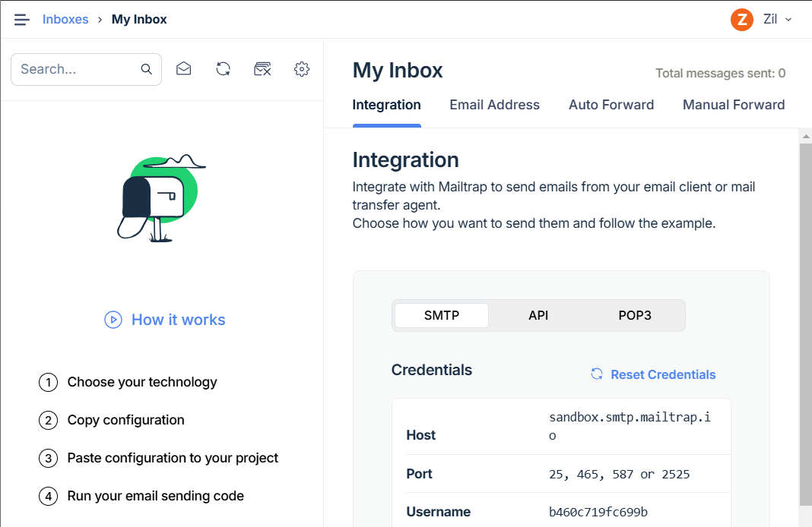
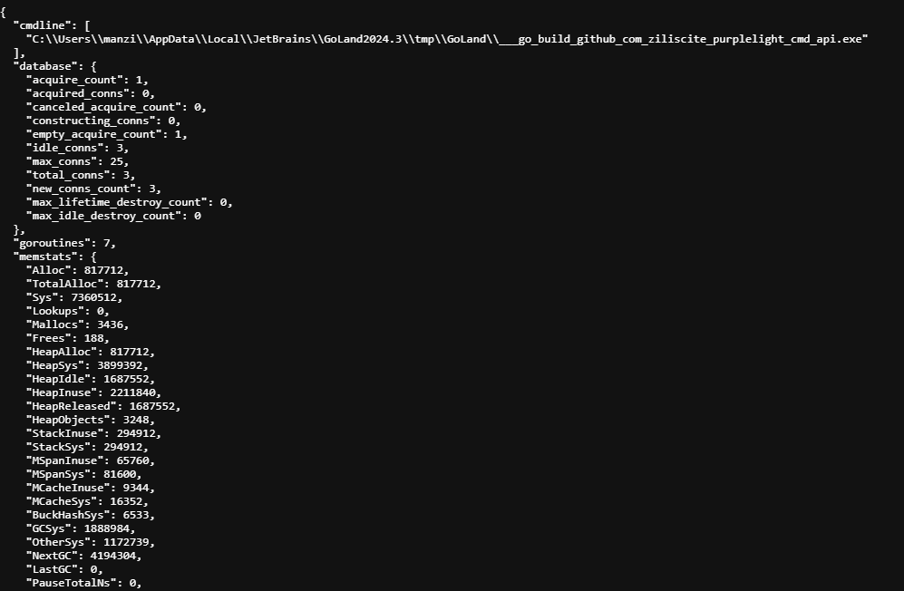
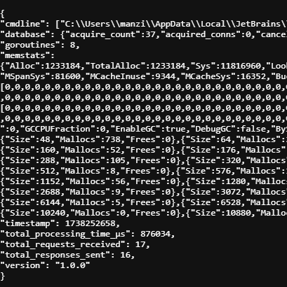

# Chapter 18. Metrics
We want to know our API performance in production, for example:  
- How much memory is my application using? How is this changing over time?
- How many goroutines are currently in use? How is this changing over time?
- How many database connections are in use and how many are idle? Do I need to change the connection pool settings?
- What is the ratio of successful HTTP responses to both client and server errors? Are error rates elevated above normal?

Having insight into these things can help inform your hardware and configuration setting choices, and act as an early warning sign of potential problems (such as memory leaks).

To assist with this, Go’s standard library includes the `expvar` package which makes it easy to collate and view different application metrics at runtime.

In this section I’ll (lmao) learn:  
- How to use the expvar package to view application metrics in JSON format via a HTTP handler.
- What default application metrics are available, and how to create your own custom application metrics for monitoring the number of active goroutines and the database connection pool.
- How to use middleware to monitor request-level application metrics, including the counts of different HTTP response status codes.

## Exposing Metrics with Expvar
`expvar` package provides an `expvar.Handler()` function which returns a HTTP handler exposing your application metrics.

By default, this handler displays information about memory usage, along with a reminder of what command-line flags you used when starting the application, all outputted in JSON format.

File: cmd/api/routes.go
```go
func (app *application) routes() http.Handler {
    router := httprouter.New()

    router.NotFound = http.HandlerFunc(app.notFoundResponse)
    router.MethodNotAllowed = http.HandlerFunc(app.methodNotAllowedResponse)

    router.HandlerFunc(http.MethodGet, "/v1/healthcheck", app.healthcheckHandler)

    router.HandlerFunc(http.MethodGet, "/v1/movies", app.requirePermission("movies:read", app.listMoviesHandler))
    router.HandlerFunc(http.MethodPost, "/v1/movies", app.requirePermission("movies:write", app.createMovieHandler))
    router.HandlerFunc(http.MethodGet, "/v1/movies/:id", app.requirePermission("movies:read", app.showMovieHandler))
    router.HandlerFunc(http.MethodPatch, "/v1/movies/:id", app.requirePermission("movies:write", app.updateMovieHandler))
    router.HandlerFunc(http.MethodDelete, "/v1/movies/:id", app.requirePermission("movies:write", app.deleteMovieHandler))

    router.HandlerFunc(http.MethodPost, "/v1/users", app.registerUserHandler)
    router.HandlerFunc(http.MethodPut, "/v1/users/activated", app.activateUserHandler)

    router.HandlerFunc(http.MethodPost, "/v1/tokens/authentication", app.createAuthenticationTokenHandler)

    // Register a new GET /debug/vars endpoint pointing to the expvar handler.
    router.Handler(http.MethodGet, "/debug/vars", expvar.Handler())

    return app.recoverPanic(app.enableCORS(app.rateLimit(app.authenticate(router))))
}
```

```shell
$ go run ./cmd/api -limiter-enabled=false -port=4000
```

And if you visit http://localhost:4000/debug/vars in your web browser, you should see a JSON response containing information about your running application.


We can see that the JSON here currently contains two top-level items: "cmdline" and "memstats".

The "cmdline" item contains an array of the command-line arguments used to run the application, beginning with the program name.

The "memstats" item contains a ‘moment-in-time’ snapshot of memory usage, as returned by the runtime.MemStats() function.

- TotalAlloc — Cumulative bytes allocated on the heap (will not decrease).
- HeapAlloc — Current number of bytes on the heap.
- HeapObjects — Current number of objects on the heap.
- Sys — Total bytes of memory obtained from the OS (i.e. total memory reserved by the Go runtime for the heap, stacks, and other internal data structures).
- NumGC — Number of completed garbage collector cycles.
- NextGC — The target heap size of the next garbage collector cycle (Go aims to keep HeapAlloc ≤ NextGC).

## Creating Custom Metrics
We’ll start really simple and first expose our application version number in the JSON.
First we need to register a custom variable with the expvar package, and then we need to set the value for the variable itself. 
```go
expvar.NewString("version").Set(version)
```

The first part of this — expvar.NewString("version") — creates a new expvar.String type, then publishes it so it appears in the expvar handler’s JSON response with the name "version", and then returns a pointer to it. Then we use the Set() method on it to assign an actual value to the pointer.

- The expvar.String type is safe for concurrent use. So — if you want to — it’s OK to manipulate this value at runtime from your application handlers.
- If you try to register two expvar variables with the same name, you’ll get a runtime panic when the duplicate variable is registered.

File: cmd/api/main.go
```go
// Remember, our version number is just a constant string (for now).
const version = "1.0.0"

...

func main() {
    ...

    // Publish a new "version" variable in the expvar handler containing our application
    // version number (currently the constant "1.0.0").
    expvar.NewString("version").Set(version)

    app := &application{
        config: cfg,
        logger: logger,
        models: data.NewModels(db),
        mailer: mailer.New(cfg.smtp.host, cfg.smtp.port, cfg.smtp.username, cfg.smtp.password, cfg.smtp.sender),
    }

    err = app.serve()
    if err != nil {
        logger.Error(err.Error())
        os.Exit(1)
    }
}
```

If you restart the API, you should now see a "version": "1.0.0" item in the JSON.

### Dynamic metrics
Occasionally you might want to publish metrics which require you to call other code — or do some kind of pre-processing — to generate the necessary information.

To help with this there is the expvar.Publish() function, which allows you to publish the result of a function in the JSON output

For example, if you want to publish the number of currently active goroutines from Go’s runtime.NumGoroutine() function, you could write the following code:
```go
expvar.Publish("goroutines", expvar.Func(func() any {
    return runtime.NumGoroutine()
}))
```

> any value returned from this function must encode to JSON without any errors.

In the case of the code snippet above, `runtime.NumGoroutine()` returns a regular int type — which will encode to a JSON number.

OK, let’s add this code to our main() function, along with two other functions which:

- Publish information about the state of our database connection pool (such as the number of idle and in-use connections) via the db.Stats() method.
- Publish the current Unix timestamp with second precision.

File: cmd/api/main.go
```go
func main() {
    ...

    expvar.NewString("version").Set(version)

    // Publish the number of active goroutines.
    expvar.Publish("goroutines", expvar.Func(func() any {
        return runtime.NumGoroutine()
    }))

    // Publish the database connection pool statistics.
    expvar.Publish("database", expvar.Func(func() any {
        return db.Stats()
    }))

    // Publish the current Unix timestamp.
    expvar.Publish("timestamp", expvar.Func(func() any {
        return time.Now().Unix()
    }))

    app := &application{
        config: cfg,
        logger: logger,
        models: data.NewModels(db),
        mailer: mailer.New(cfg.smtp.host, cfg.smtp.port, cfg.smtp.username, cfg.smtp.password, cfg.smtp.sender),
    }

    err = app.serve()
    if err != nil {
        logger.Error(err.Error())
        os.Exit(1)
    }
}
```

It looks like this


If you like, you can use a tool like [hey](https://github.com/rakyll/hey) to generate some requests to your application and see how these figures change under load. For example, you can send a batch of requests to the `POST /v1/tokens/authentication` endpoint (which is slow and costly because it checks a bcrypt-hashed password).
```shell
$ BODY='{"email": "alice@example.com", "password": "pa55word"}'
$ hey -d "$BODY" -m "POST" http://localhost:4000/v1/tokens/authentication

Summary:
  Total:        8.0979 secs
  Slowest:      2.4612 secs
  Fastest:      1.6169 secs
  Average:      1.9936 secs
  Requests/sec: 24.6977
  
  Total data:   24975 bytes
  Size/request: 124 bytes

Response time histogram:
  1.617 [1]  |■
  1.701 [6]  |■■■■■
  1.786 [10] |■■■■■■■■■
  1.870 [26] |■■■■■■■■■■■■■■■■■■■■■■■
  1.955 [36] |■■■■■■■■■■■■■■■■■■■■■■■■■■■■■■■
  2.039 [46] |■■■■■■■■■■■■■■■■■■■■■■■■■■■■■■■■■■■■■■■■
  2.123 [36] |■■■■■■■■■■■■■■■■■■■■■■■■■■■■■■■
  2.208 [21] |■■■■■■■■■■■■■■■■■■
  2.292 [12] |■■■■■■■■■■
  2.377 [4]  |■■■
  2.461 [2]  |■■


Latency distribution:
  10% in 1.8143 secs
  25% in 1.8871 secs
  50% in 1.9867 secs
  75% in 2.1000 secs
  90% in 2.2017 secs
  95% in 2.2642 secs
  99% in 2.3799 secs

Details (average, fastest, slowest):
  DNS+dialup:	0.0009 secs, 1.6169 secs, 2.4612 secs
  DNS-lookup:	0.0005 secs, 0.0000 secs, 0.0030 secs
  req write:	0.0002 secs, 0.0000 secs, 0.0051 secs
  resp wait:	1.9924 secs, 1.6168 secs, 2.4583 secs
  resp read:	0.0000 secs, 0.0000 secs, 0.0001 secs

Status code distribution:
  [201]	200 responses
```

> Make sure that your API has the rate limiter turned off with the -limiter-enabled=false command-line flag before you run this, otherwise the hey tool will receive a lot of 429 Too Many Requests responses.

### Protecting the metrics endpoint
It’s important to be aware that these metrics provide very useful information to anyone who wants to perform a denial-of-service attack against your application, and that the "cmdline" values may also expose potentially sensitive information (like a database DSN).

So you should make sure to restrict access to the `GET /debug/vars` endpoint when running in a production environment.

There are a few different approaches you could take to do this.

One option is to leverage our existing authentication process and create a `metrics:view` permission so that only certain trusted users can access the endpoint. Another option would be to use HTTP Basic Authentication to restrict access to the endpoint.

## Request-level Metrics
In this chapter we’re going to create some new middleware to record custom request-level metrics for our application.

- The total number of requests received.
- The total number of responses sent.
- The total (cumulative) time taken to process all requests in microseconds.

All these values will be integers, so we’ll be able to register these metrics with the `expvar` package using the `expvar.NewInt()` function.

File: cmd/api/middleware.go
```go
func (app *application) metrics(next http.Handler) http.Handler {
    // Initialize the new expvar variables when the middleware chain is first built.
    var (
        totalRequestsReceived           = expvar.NewInt("total_requests_received")
        totalResponsesSent              = expvar.NewInt("total_responses_sent")
        totalProcessingTimeMicroseconds = expvar.NewInt("total_processing_time_μs")
    )

    // The following code will be run for every request...
    return http.HandlerFunc(func(w http.ResponseWriter, r *http.Request) {
        // Record the time that we started to process the request.
        start := time.Now()

        // Use the Add() method to increment the number of requests received by 1.
        totalRequestsReceived.Add(1)

        // Call the next handler in the chain.
        next.ServeHTTP(w, r)

        // On the way back up the middleware chain, increment the number of responses
        // sent by 1.
        totalResponsesSent.Add(1)

        // Calculate the number of microseconds since we began to process the request,
        // then increment the total processing time by this amount.
        duration := time.Since(start).Microseconds()
        totalProcessingTimeMicroseconds.Add(duration)
    })
}
```

File: cmd/api/routes.go
```go
func (app *application) routes() http.Handler {
    router := httprouter.New()

    router.NotFound = http.HandlerFunc(app.notFoundResponse)
    router.MethodNotAllowed = http.HandlerFunc(app.methodNotAllowedResponse)

    router.HandlerFunc(http.MethodGet, "/v1/healthcheck", app.healthcheckHandler)

    router.HandlerFunc(http.MethodGet, "/v1/movies", app.requirePermission("movies:read", app.listMoviesHandler))
    router.HandlerFunc(http.MethodPost, "/v1/movies", app.requirePermission("movies:write", app.createMovieHandler))
    router.HandlerFunc(http.MethodGet, "/v1/movies/:id", app.requirePermission("movies:read", app.showMovieHandler))
    router.HandlerFunc(http.MethodPatch, "/v1/movies/:id", app.requirePermission("movies:write", app.updateMovieHandler))
    router.HandlerFunc(http.MethodDelete, "/v1/movies/:id", app.requirePermission("movies:write", app.deleteMovieHandler))

    router.HandlerFunc(http.MethodPost, "/v1/users", app.registerUserHandler)
    router.HandlerFunc(http.MethodPut, "/v1/users/activated", app.activateUserHandler)

    router.HandlerFunc(http.MethodPost, "/v1/tokens/authentication", app.createAuthenticationTokenHandler)

    router.Handler(http.MethodGet, "/debug/vars", expvar.Handler())

    // Use the new metrics() middleware at the start of the chain.
    return app.metrics(app.recoverPanic(app.enableCORS(app.rateLimit(app.authenticate(router)))))
}
```



At first, we can see that our API has received one request and sent zero responses. That makes sense if you think about it — at the moment that this JSON response was generated, it hadn’t actually been sent.

### Calculating additional metrics
Based on this information in the GET /debug/vars response, you can also derive some additional interesting metrics. Such as

- The number of ‘active’ in-flight requests:
```shell
total_requests_received - total_responses_sent
```

- The average number of requests received per second (between calls A and B to the GET /debug/vars endpoint):
```shell
(total_requests_received_B - total_requests_received_A) / (timestamp_B - timestamp_A)
```

- The average processing time per request (between calls A and B to the GET /debug/vars endpoint):
```shell
(total_processing_time_μs_B - total_processing_time_μs_A) / (total_requests_received_B - total_requests_received_A)
```

## Recording HTTP Status Codes
As well as recording the total count of responses sent, we can take this further and extend our metrics() middleware to start tallying exactly which HTTP status codes our responses had.

The tricky part of doing this is finding out what HTTP status code a response has in our metrics() middleware.

To capture the response status code, we’ll instead need to create our own custom http.ResponseWriter that records a copy of the HTTP status code for future access.
```go
// The metricsResponseWriter type wraps an existing http.ResponseWriter and also
// contains a field for recording the response status code, and a boolean flag to
// indicate whether the response headers have already been written.
type metricsResponseWriter struct {
    wrapped       http.ResponseWriter
    statusCode    int
    headerWritten bool
}

// This function returns a new metricsResponseWriter instance which wraps a given 
// http.ResponseWriter and has a status code of 200 (which is the status
// code that Go will send in a HTTP response by default).
func newMetricsResponseWriter(w http.ResponseWriter) *metricsResponseWriter {
    return &metricsResponseWriter{
        wrapped:    w,
        statusCode: http.StatusOK,
    }
}

// The Header() method is a simple 'pass through' to the Header() method of the
// wrapped http.ResponseWriter.
func (mw *metricsResponseWriter) Header() http.Header {
    return mw.wrapped.Header()
}

// Again, the WriteHeader() method does a 'pass through' to the WriteHeader()
// method of the wrapped http.ResponseWriter. But after this returns,
// we also record the response status code (if it hasn't already been recorded)
// and set the headerWritten field to true to indicate that the HTTP response  
// headers have now been written.
func (mw *metricsResponseWriter) WriteHeader(statusCode int) {
    mw.wrapped.WriteHeader(statusCode)

    if !mw.headerWritten {
        mw.statusCode = statusCode
        mw.headerWritten = true
    }
}

// Likewise the Write() method does a 'pass through' to the Write() method of the
// wrapped http.ResponseWriter. Calling this will automatically write any 
// response headers, so we set the headerWritten field to true.
func (mw *metricsResponseWriter) Write(b []byte) (int, error) {
    mw.headerWritten = true
    return mw.wrapped.Write(b)
}

// We also need an Unwrap() method which returns the existing wrapped
// http.ResponseWriter.
func (mw *metricsResponseWriter) Unwrap() http.ResponseWriter {
    return mw.wrapped
}
```

The important thing to realize is that our metricsResponseWriter type satisfies the http.ResponseWriter interface.

Also, notice that we don’t record the status code until after the ‘pass through’ call in the WriteHeader() method. This is because a panic in that operation (potentially due to an invalid status code) may mean that a different status code is ultimately sent to the client.

Lastly, we also set a default status code of 200 OK in the newMetricsResponseWriter() function. It’s important that we set this default here, in case a handler doesn’t ever call Write() or WriteHeader().

File: cmd/api/middleware.go
```go
type metricsResponseWriter struct {
    wrapped       http.ResponseWriter
    statusCode    int
    headerWritten bool
}

func newMetricsResponseWriter(w http.ResponseWriter) *metricsResponseWriter {
    return &metricsResponseWriter{
        wrapped:    w,
        statusCode: http.StatusOK,
    }
}

func (mw *metricsResponseWriter) Header() http.Header {
    return mw.wrapped.Header()
}

func (mw *metricsResponseWriter) WriteHeader(statusCode int) {
    mw.wrapped.WriteHeader(statusCode)

    if !mw.headerWritten {
        mw.statusCode = statusCode
        mw.headerWritten = true
    }
}

func (mw *metricsResponseWriter) Write(b []byte) (int, error) {
    mw.headerWritten = true
    return mw.wrapped.Write(b)
}

func (mw *metricsResponseWriter) Unwrap() http.ResponseWriter {
    return mw.wrapped
}

func (app *application) metrics(next http.Handler) http.Handler {
    var (
        totalRequestsReceived           = expvar.NewInt("total_requests_received")
        totalResponsesSent              = expvar.NewInt("total_responses_sent")
        totalProcessingTimeMicroseconds = expvar.NewInt("total_processing_time_μs")

        // Declare a new expvar map to hold the count of responses for each HTTP status
        // code.
        totalResponsesSentByStatus = expvar.NewMap("total_responses_sent_by_status")
    )

    return http.HandlerFunc(func(w http.ResponseWriter, r *http.Request) {
        start := time.Now()

        totalRequestsReceived.Add(1)

        // Create a new metricsResponseWriter, which wraps the original  
        // http.ResponseWriter value that the metrics middleware received.
        mw := newMetricsResponseWriter(w)
        
        // Call the next handler in the chain using the new metricsResponseWriter
        // as the http.ResponseWriter value.
        next.ServeHTTP(mw, r)

        totalResponsesSent.Add(1)

        // At this point, the response status code should be stored in the
        // mw.statusCode field. Note that the expvar map is string-keyed, so we
        // need to use the strconv.Itoa() function to convert the status code
        // (which is an integer) to a string. Then we use the Add() method on
        // our new totalResponsesSentByStatus map to increment the count for the
        // given status code by 1.
        totalResponsesSentByStatus.Add(strconv.Itoa(mw.statusCode), 1)

        duration := time.Since(start).Microseconds()
        totalProcessingTimeMicroseconds.Add(duration)
    })
}
```

### Visualizing and analyzing metrics
What should you do with them?

The answer to this will be different from project-to-project.

For some low-value applications, it might be sufficient to manually spot check the metrics every so often — or only when you suspect a problem — and make sure that nothing looks unusual or out of place.

In other projects, you might want to write a script to periodically fetch the JSON data from the GET /debug/vars endpoint and carry out further analysis. This might include functionality to alert you if something appears to be abnormal.

At the other end of the spectrum, you might want to use a tool like Prometheus to fetch and visualize the data from the endpoint, and display graphs of the metrics in real-time.

There are a lot of different options, and the right thing to do really depends on the needs of your project and business. But in all cases, using the expvar package to collect and publish the metrics gives you a great platform from which you can integrate any external monitoring, alerting or visualization tools.

